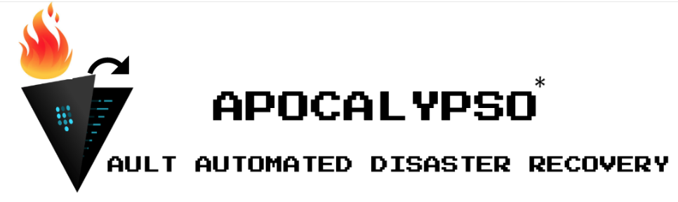

(* Apocalypso because it is an orchestrated (calypso) recovery of an apocalyptic disaster  (•◡•)) 

# **Background**
While HashiCorp provides documentation for Vault Disaster Recovery, they do not provide an out-of-the-box automation solution. A Disaster event, such as an entire AWS region going down, is a pretty catastrophic scenario when operator nerves will be tested. In such a situation, leaving such an important operation such as Vault Disaster Recovery as a series of manual tasks can be pretty dangerous and thus inherently error-prone.

We decided to automate the recovery process by failing over to another passive secondary cluster located in an alternate AWS region. In the best case scenario, the cross-region cluster failover takes 70 seconds (out of which 60 seconds belongs to a deliberate sleep for tolerating a DNS propagation delay of the update of the cluster DNS CNAME from the primary ELB A-record to the secondary ELB A-record). However, this 70 seconds downtime is within the a 90-day error budget of 77 seconds (or 1 minute 17 seconds). The error budget of 1 minute 17 seconds for a 90 day window is derived from the fact that for a target SLO of 99.999% availability, the maximum downtime each day is 864.00 milliseconds (or 0.864 seconds) and thus:

Maximum downtime for 90 days with an SLO of 99.999% availability = (0.864 * 90) seconds = 77.76 seconds ~= 1 min 17 seconds.

So, we decided to share what we developed with other Vault customers; after all sharing is caring. And thus, we are making our code open source.

# Version of Vault used
This code has been tested with the following version of Vault:

Vault v1.1.2+prem ('c1bd8914ddf4a3e3f7d0b683b0c5670076166932')

# **Based on Amazon Web Services**
While Vault customers may differ in what they use in terms of public cloud, DNS server, etc., this code depends on Amazon Web Services (AWS) and Route 53 for DNS.

Hopefully, there will be contributions from the community that will allow people to extend this solution for other environments such as:
* Microsoft Azure
* Google Cloud Platform
* vmWare
* etc.

# A note about ELB health rules in order to communicate with secondary Vault cluster
Once you have enabled DR replication on the secondary Vault cluster, it becomes dormant/unresponsive to the Elastic Load Balancer (and thus any script trying to reach it) unless you explicitly set the ELB Health Check to include a DR secondary code equal to 200 :

HTTPS:8200/v1/sys/health?standbyok=true&drsecondarycode=200
# **User Guide**

## 1. **Environment variables:**
You need to set these environment variables, prior to invoking the python script (so as to ensure a non-interactive execution). Otherwise, you will be prompted interactively for this information.

Environment variables to be set before invoking run_vault_dr.py
```
export VAULT_TOKEN=<...>
export VAULT_RECOVERY_KEY_1=<...>
export VAULT_RECOVERY_KEY_2=<...>
export VAULT_RECOVERY_KEY_3=<...>
export AWS_ACCESS_KEY_ID=<...>
export AWS_SECRET_ACCESS_KEY=<...>
```
## 2. **Prerequisites:** 
May need to install Python3.6 and the Python libraries specified in the file requirements.txt. Ubuntu 17.10, Ubuntu 18.04 (and above) come with Python 3.6 by default. If not, installation instructions for that are here: https://realpython.com/installing-python/#ubuntu 

```
$ pip3 install -r requirements.txt
```
## 3. **Configuring the cluster domains for each environment:**
Edit the file `src/vault_dr.cfg` and change the variables to reflect your values for each of your environments.

```
[Vault-Cluster-Prod]
prod_primary_vault_cluster_domain=https://internal-us-west-2-prod-vault-970240217.us-west-2.elb.amazonaws.com
prod_secondary_vault_cluster_domain=https://internal-us-east-1-prod-vault-1155116178.us-east-1.elb.amazonaws.com
prod_cluster_cname=vault.prod.acme.com
[Vault-Cluster-Staging]
staging_primary_vault_cluster_domain=https://internal-us-west-2-staging-vault-812833316.us-west-2.elb.amazonaws.com
staging_secondary_vault_cluster_domain=https://internal-us-east-1-staging-vault-2098328888.us-east-1.elb.amazonaws.com
staging_cluster_cname=vault.staging.acme.com
[Vault-Cluster-Test]
test_primary_vault_cluster_domain=https://internal-us-west-2-test-vault-237674251.us-west-2.elb.amazonaws.com
test_secondary_vault_cluster_domain=https://internal-us-east-1-test-vault-1332090699.us-east-1.elb.amazonaws.com
test_cluster_cname=vault.test.acme.com
[AWS-Route-53]
HostedZoneID=hZ3DG6IL3SJCGPX
```

## 4. **Invoking the script:**
If you have Python3 installed on your machine, you can invoke the script directly.

First change to the src directory:
```
$ cd src
```

Use the parameters for DR mode and environment.
```
Usage: ./run_vault_dr.py {failover|failback} {prod|staging|test}
```
For example:
```
$./run_vault_dr.py failover test
```
The output you see may look something like this:
```
$ ./run_vault_dr.py failover test
[Wed, 18 Sep 2019 17:02:15] *** About to start Vault Disaster Recovery Operation. Failing over from https://internal-us-west-2-test-vault-438731756.us-west-2.elb.amazonaws.com to https://internal-us-east-1-test-vault-2124428973.us-east-1.elb.amazonaws.com
[Wed, 18 Sep 2019 17:02:15] *** About to check the replication status on the secondary cluster: https://internal-us-east-1-test-vault-2124428973.us-east-1.elb.amazonaws.com
[Wed, 18 Sep 2019 17:02:15] *** About to start the DR token generation process on the secondary cluster: https://internal-us-east-1-test-vault-2124428973.us-east-1.elb.amazonaws.com
[Wed, 18 Sep 2019 17:02:16] *** About to continue the DR token generation process on the secondary cluster: https://internal-us-east-1-test-vault-2124428973.us-east-1.elb.amazonaws.com
[Wed, 18 Sep 2019 17:02:17] *** About to promote the current secondary to a primary on the secondary cluster: https://internal-us-east-1-test-vault-2124428973.us-east-1.elb.amazonaws.com
[Wed, 18 Sep 2019 17:02:19] *** About to change the CNAME vault.test.acme.com in DNS to point to the new primary https://internal-us-east-1-test-vault-2124428973.us-east-1.elb.amazonaws.com
[Wed, 18 Sep 2019 17:02:20] *** About to sleep for 60 seconds for DNS changes to propagate before demoting old primary https://internal-us-west-2-test-vault-438731756.us-west-2.elb.amazonaws.com
[Wed, 18 Sep 2019 17:03:20] *** About to demote the old primary to a secondary https://internal-us-west-2-test-vault-438731756.us-west-2.elb.amazonaws.com
[Wed, 18 Sep 2019 17:03:21] *** About to generate a new secondary-token from the new primary https://internal-us-east-1-test-vault-2124428973.us-east-1.elb.amazonaws.com
[Wed, 18 Sep 2019 17:03:21] *** About to start generating a new DR operation token on the new secondary https://internal-us-west-2-test-vault-438731756.us-west-2.elb.amazonaws.com
[Wed, 18 Sep 2019 17:03:23] *** About to continue generating a new DR operation token on the new secondary https://internal-us-west-2-test-vault-438731756.us-west-2.elb.amazonaws.com
[Wed, 18 Sep 2019 17:03:24] *** About to update the new secondary with the secondary token https://internal-us-west-2-test-vault-438731756.us-west-2.elb.amazonaws.com
[Wed, 18 Sep 2019 17:03:25] *** Vault Disaster Recovery Operation Successful. Failed over from https://internal-us-west-2-test-vault-438731756.us-west-2.elb.amazonaws.com to https://internal-us-east-1-test-vault-2124428973.us-east-1.elb.amazonaws.com
```
Sometimes, the default DNS_PROPAGATION_DELAY of 60 seconds may not be sufficient and the update-primary command may fail. The script implements an exponential backoff retry mechanism with an exponential backoff function of (2**(Retry-Number-1)*30 + random.randomint(1,999)/1000) seconds and a maximum number of 10 retries. Based on initial test results, it has been observed to converge at a maximum of 3 retries. In such as case, your output may look like this:

```
$ ./run_vault_dr.py failover test
[Thu, 19 Sep 2019 12:26:41] *** About to start Vault Disaster Recovery Operation. Failing over from https://internal-us-west-2-test-vault-438731756.us-west-2.elb.amazonaws.com to https://internal-us-east-1-test-vault-2124428973.us-east-1.elb.amazonaws.com
[Thu, 19 Sep 2019 12:26:41] *** About to check the replication status on the secondary cluster: https://internal-us-east-1-test-vault-2124428973.us-east-1.elb.amazonaws.com
[Thu, 19 Sep 2019 12:26:42] *** About to start the DR token generation process on the secondary cluster: https://internal-us-east-1-test-vault-2124428973.us-east-1.elb.amazonaws.com
[Thu, 19 Sep 2019 12:26:43] *** About to continue the DR token generation process on the secondary cluster: https://internal-us-east-1-test-vault-2124428973.us-east-1.elb.amazonaws.com
[Thu, 19 Sep 2019 12:26:44] *** About to promote the current secondary to a primary on the secondary cluster: https://internal-us-east-1-test-vault-2124428973.us-east-1.elb.amazonaws.com
[Thu, 19 Sep 2019 12:26:46] *** About to change the CNAME vault.test.acme.com in DNS to point to the new primary https://internal-us-east-1-test-vault-2124428973.us-east-1.elb.amazonaws.com
[Thu, 19 Sep 2019 12:26:47] *** About to sleep for 60 seconds for DNS changes to propagate before demoting old primary https://internal-us-west-2-test-vault-438731756.us-west-2.elb.amazonaws.com
[Thu, 19 Sep 2019 12:27:47] *** About to demote the old primary to a secondary https://internal-us-west-2-test-vault-438731756.us-west-2.elb.amazonaws.com
[Thu, 19 Sep 2019 12:27:47] *** About to generate a new secondary-token from the new primary https://internal-us-east-1-test-vault-2124428973.us-east-1.elb.amazonaws.com
[Thu, 19 Sep 2019 12:27:48] *** About to start generating a new DR operation token on the new secondary https://internal-us-west-2-test-vault-438731756.us-west-2.elb.amazonaws.com
[Thu, 19 Sep 2019 12:27:49] *** About to continue generating a new DR operation token on the new secondary https://internal-us-west-2-test-vault-438731756.us-west-2.elb.amazonaws.com
[Thu, 19 Sep 2019 12:27:50] *** About to update the new secondary with the secondary token https://internal-us-west-2-test-vault-438731756.us-west-2.elb.amazonaws.com
HTTPError: 500 Server Error: Internal Server Error for url: https://internal-us-west-2-test-vault-438731756.us-west-2.elb.amazonaws.com/v1/sys/replication/dr/secondary/update-primary occurred while executing POST : https://internal-us-west-2-test-vault-438731756.us-west-2.elb.amazonaws.com/v1/sys/replication/dr/secondary/update-primary
Details: {"errors":["error response unwrapping secondary token; status code is 400, message is \"400 Bad Request\""]}
 
[Thu, 19 Sep 2019 12:27:50] *** Retry attempt 1 after exponential backoff of 30.254 seconds
[Thu, 19 Sep 2019 12:28:52] *** Vault Disaster Recovery Operation Successful. Failed over from https://internal-us-west-2-test-vault-438731756.us-west-2.elb.amazonaws.com to https://internal-us-east-1-test-vault-2124428973.us-east-1.elb.amazonaws.com
```
If you're experiencing frequent retries, try setting the environment variable DNS_PROPAGATION_DELAY to a value higher than 60 prior to running the script as shown below:
```
export DNS_PROPAGATION_DELAY=120
```
## 5. Clean-up:
After invocation, please unset the environment variables since we do not want those secrets leaking for all and sundry to peruse.
Unset Environment variables after invoking run_vault_dr.py
```
unset VAULT_TOKEN
unset VAULT_RECOVERY_KEY_1
unset VAULT_RECOVERY_KEY_2
unset VAULT_RECOVERY_KEY_3
unset AWS_ACCESS_KEY_ID
unset AWS_SECRET_ACCESS_KEY
```
